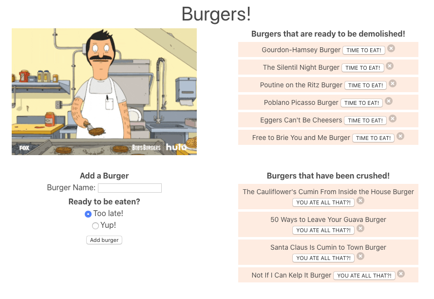

## Table of Contents
##### 1. [Project Description](#Project-Description)
##### 2. [GitHub Address](#GitHub-Address)
##### 3. [License Type](#License-Type)
##### 4. [Dependencies](#Dependencies)
##### 5. [Test Run Commands](#Test-Run-Commands)
##### 6. [Author Contact Information](#Author-Contact-Information)
---
# **Eat The Burger**

### **Project Description:**
##### This website takes burger names entered by the user, stores the names in an SQL database and puts them in one of two categories. You can then move them from one category to the other by clicking on their button, or delete them from the SQL database all together.
---
### **GitHub Address:**
[Eat The Burger](https://github.com/rysiphoto/EatTheBurger)
---
### **License Type:**
##### MIT

---
### **Dependencies**
##### npm i
---
### **Test Run Commands**
##### node server
---
### **Interface**

---
### **Author Contact Information:**

* Ryan Siverson
* rcsskier@mac.com
* [GitHub](https://github.com/rysiphoto)
* [LinkedIn](https://www.linkedin.com/in/ryan-siverson-695b5a32/)

---
---
###### © Ryan Siverson 2020
